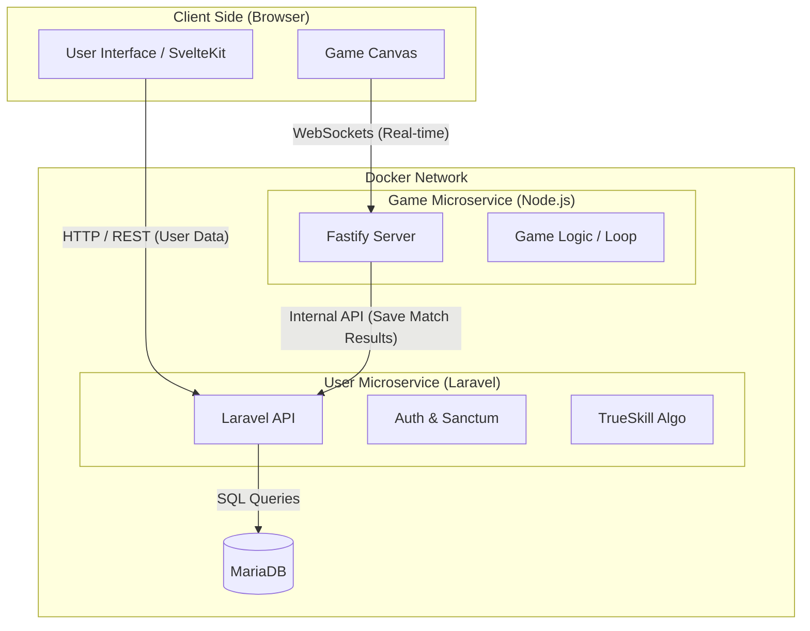

*This project has been created as part of the 42 curriculum by fras, hesmolde, qmennen, whaffman, qbeukelm.*

# ft_transcendence: Achtung, die Kurve! (Web Edition)


## 📖 Description

**ft_transcendence** is the final project of the 42 Common Core curriculum. Our team is building a modern, web-based adaptation of the classic DOS game **"Achtung, die Kurve!"** (Curve Fever), engineered on a robust, microservice-oriented architecture.

The project goes beyond simple gameplay; it is designed as a scalable platform where high-frequency game logic is decoupled from persistent user data management. We utilize a dual-backend approach: a high-performance **Node.js/Fastify** server for real-time game simulation and a **Laravel** API for robust user management and statistics, all powered by a **MariaDB** database.

### Key Features
* **"Achtung, die Kurve!" Gameplay:** Fast-paced, multiplayer survival game where players steer expanding lines to cut off opponents.
* **Microservice Architecture:** Separation of concerns between the Game Engine (Node.js) and User Services (Laravel).
* **TrueSkill Leaderboards:** Implementation of the TrueSkill ranking system for accurate, competitive matchmaking.
* **Real-time Performance:** WebSocket-driven game state synchronization for smooth, lag-free gameplay.
* **Secure Authentication:** Robust user identity management via Laravel.

---

## 👥 Team Information

Our team operates using Agile methodologies, with clear role separation to ensure code quality, architectural integrity, and product vision.

| Name | Login | Role(s) | Responsibilities |
| :--- | :--- | :--- | :--- |
| **Ferry Ras** | `fras` | **Product Owner (PO)** & Dev | • Defines product vision and roadmap.<br>• Prioritizes the backlog and feature requirements.<br>• Maintains Trello board and syncs with PM.<br>• Validates completed work against requirements. |
| **Hein Smolder** | `hesmolde` | **Project Manager (PM)** & Dev | • Tracks progress, deadlines, and team coordination.<br>• Coordinates with PO and Development.<br>• Facilitates Scrum process and removes blockers. |
| **Willem Haffmans** | `whaffman` | **Tech Lead (Architecture)** & Dev | • Defines technical architecture and system design.<br>• Makes final decisions on the technology stack.<br>• Ensures modular interoperability between Node and Laravel services. |
| **Quinten Mennen** | `qmennen` | **Tech Lead (Quality)** & Dev | • Enforces code quality standards and best practices.<br>• Reviews critical code changes.<br>• Manages CI/CD pipelines and linting rules. |
| **Quentin Beukelman** | `qbeukelm` | **Dedicated Developer** | • Focuses on core feature implementation.<br>• Rapid prototyping and module development.<br>• End-to-end testing of implemented features. |

> **Note:** As per project requirements, all team members actively contribute to the codebase as Developers.

---

## 🛠️ Technical Stack & Architecture

We have chosen a hybrid stack that leverages the specific strengths of different frameworks for different domains (Real-time vs. CRUD).

### Core Technologies
* **Frontend:** **Svelte / SvelteKit**. Selected for its high performance and reactivity, essential for rendering game canvas updates and managing lobby state efficiently.
* **Game Backend:** **Node.js (Fastify)**. Handles the high-frequency game loop, WebSocket connections, collision detection, and authoritative state simulation.
* **User Backend:** **Laravel (PHP)**. Manages RESTful API endpoints for user profiles, statistics, authentication, and achievements.
* **Database:** **MariaDB**. The central persistent storage for user data and game history.
* **Ranking Algorithm:** **TrueSkill**. Used for calculating player skill levels ("ELO-style") and matchmaking.

### Development Quality Tools
To maintain a professional codebase suitable for long-term maintenance:
* **Husky:** Manages Git hooks to prevent bad commits.
* **Commitlint:** Enforces semantic commit messages (e.g., `feat:`, `fix:`, `chore:`) for clean history.
* **ESLint:** Runs pre-commit to catch syntax and style errors early.
* **Style Enforcer:** *[TODO: Decide on Prettier/PHP-CS-Fixer configuration]*

### Architecture Overview
The system is divided into three primary containers communicating via internal networking:
1. **Frontend (Svelte):** Renders the Canvas, Lobby UI, and connects to both backends.
2. **Game Service (Fastify):** WebSocket Server. Authoritative simulation. Emits state ticks to clients. Writes match results to Laravel.
3. **User Service (Laravel):** HTTP API. Handles Auth, User Profile, Stats history, and Leaderboard calculations.

The system follows a strict microservice pattern. The diagram below illustrates how the Client interacts with the two distinct backends.



---

## 🚀 Instructions

### Prerequisites
* Docker & Docker Compose (Latest version)
* Node.js & npm (for local tooling installation)
* Git

### Installation & Execution
This project runs via Docker containers to ensure consistency.

1.  **Clone the repository:**
    ```bash
    git clone https://github.com/**username-or-org**/ft_transcendence.git
    cd ft_transcendence
    ```

2.  **Environment Setup:**
    Create the `.env` file from the example.
    ```bash
    cp .env.example .env
    # Edit .env to configure DB credentials and API keys
    ```

3.  **Run the Application:**
    The entire stack (Svelte, Node, Laravel, MariaDB) can be launched with a single command:
    ```bash
    make
    ```

4.  **Access:**
    * **Application:** `http://localhost:8080`
    * **Laravel API:** `http://localhost:8080/api`
    * **Game Server (WS):** `ws://localhost:3000` (Internal)

---

## 📅 Project Management

We utilize a hybrid toolset to distinguish between "Product Definition" and "Technical Execution," ensuring clear separation of concerns between the PO and PM.

1.  **Product Backlog (Trello):**
    * **Owner:** **Ferry (PO)**.
    * **Purpose:** Defines *what* we are building. The PO populates this with Epics and User Stories, prioritizing them based on the product vision.
2.  **Sprint Backlog (GitHub Issues):**
    * **Owner:** **Hein (PM)**.
    * **Purpose:** Defines *who* does it and *when*. Assigns GitHub Issues to developers, and sets milestones.

## 📞 Communication & Sync Schedule

**Cadence:**
* **Weekly Sprint Planning:** Tuesdays at start of day.
* **Daily Standups:** Wednesdays and Thursdays (13 PM).
* **Sprint Review & Retrospective:** Thursdays at end of day.

**Channels:**
* **Trello (Macro):** Product-level planning and prioritization (PO-owned).
* **GitHub Issues (Micro):** Sprint task breakdown and developer assignments (PM-owned).
* **Scrum Process:** Weekly cadence with structured ceremonies for feedback and iteration.

---

## 🧩 Modules (14+ Points Target)

*This section details the modules chosen to meet the project requirements. [Status: Planning Phase]*

| Category | Module | Pts | Status | Owner(s) | Justification/Implementation |
| :--- | :--- | :--- | :--- | :--- | :--- |
| **Web** | Framework (Laravel + Fastify/Svelte) | 2 | 🚧 | All | Using industry-standard frameworks: Laravel for API robustness, Fastify for speed, Svelte for reactive UI. |
| **Web** | Realtime features (WebSockets) | 2 | 🚧 | All | Real-time game state updates (60 ticks/s), lobby chat, and live connection handling. |
| **Web** | User Interaction | 2 | 🚧 | All | Basic chat, profile viewing, and friend management via Laravel API. |
| **Web** | Public API | 2 | 🚧 | All | Secured Laravel API with rate limiting (Sanctum/Throttle), documentation, and 5+ endpoints. |
| **Web** | Database ORM | 1 | 🚧 | All | Using Eloquent ORM (Laravel) for complex relationships and queries. |
| **User** | User Management & Auth | 2 | 🚧 | All | Secure sign-up/login, avatar uploads, and profile management. |
| **User** | Game Stat and History | 1 | 🚧 | All | Tracking wins/losses, match history, and TrueSkill ranking via Laravel. |
| **Game** | Complete web-based game | 2 | 🚧 | All | "Achtung, die Kurve!": Real-time multiplayer snake-style survival game. |
| **Game** | Remote players (two) | 2 | 🚧 | All | Smooth synchronization for 1v1 matches over the network. |
| **Game** | Multiplayer game (3+) | 2 | 🚧 | All | Support for 3+ players simultaneously in the same arena. |
| **Devops** | Backend as Microservices | 2 | 🚧 | All | Explicit separation: Node.js for Game Logic vs. Laravel for User Data. |

**Optional / TBD:**
| Category | Module | Pts | Status | Owner(s) | Justification/Implementation |
| :--- | :--- | :--- | :--- | :--- | :--- |
| **...** | ... | ... | ... | ... | *[TODO: Populate as we select modules]* |

> **Total Points Planned:** 20 / 14 (6 more than mandatory)

---

## 🤖 AI Usage Guidelines

In compliance with the project subject, we utilize AI (Copilot, ChatGPT, Claude) to enhance productivity while maintaining full understanding of our code.

* **Boilerplate Generation:** Used to generate initial component structures and Docker configurations.
* **Debugging:** Used to analyze stack traces and suggest fixes for obscure framework edge cases.
* **Documentation:** Used to help format and spell-check this README and internal docs.

**Validation Protocol:** All AI-generated code is reviewed by a peer (Tech Lead) and must be fully understood by the implementer. We do not copy-paste complex logic without line-by-line verification.

---

## ⚖️ Legal & Compliance

* **Privacy Policy:** Accessible via the application footer.
* **Terms of Service:** Accessible via the application footer.
* **Browser Support:** Optimized for the latest stable Google Chrome. Compatible with Firefox and Safari.