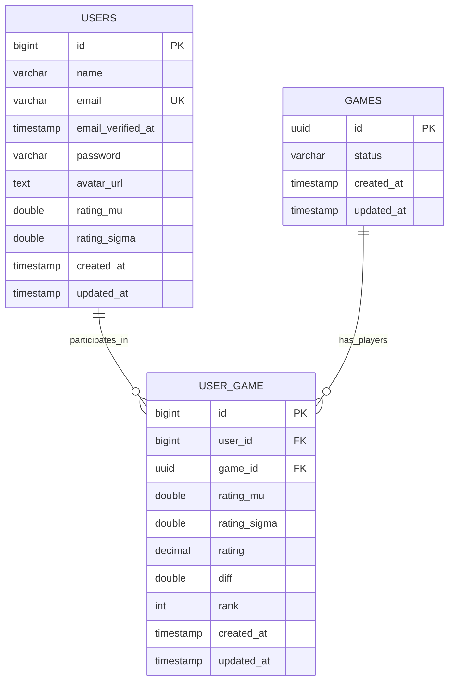

*This project has been created as part of the 42 curriculum by fras, hesmolde, qbeukelm, qmennen, whaffman.*

<br/>

<h1 align="center">
    Achtung, die Kurve!
</h1>

<br/>

<p align="center">
  
</p>


Long before microservices, before WebSockets, before Docker containers dutifully spun in the background, there was a simple idea:

> *"What if turning left or right was enough to ruin a friendship?"*

The Curve traces its origins to early multiplayer arcade experiences — most notably the browser classic Achtung, die Kurve! — a game defined by minimal mechanics and emergent complexity. Each player moves continuously, leaving a persistent trail behind. The objective is straightforward: survive by avoiding collisions with walls, opponents, and most critically, oneself.

From this minimal rule set emerges strategic depth. Movement is deterministic. Space is finite. Every decision reshapes the arena in real time. Success depends not on randomness, but on anticipation, spatial reasoning, and controlled execution.

This project presents a modern, web-based interpretation of that classic concept. Built using a service-oriented architecture and real-time communication protocols, it preserves the elegance of the original while introducing persistent user management, rating systems, and synchronized multiplayer gameplay. Its purpose is educational: to apply advanced full-stack web engineering principles in a collaborative environment, transforming a simple game concept into a scalable, real-time distributed system.

*Every match is a study in controlled chaos.<br/>
Every gap is either mercy or trap. <br/>
There is no randomness in failure. Only geometry.*

Welcome to *Achtung, die Kurve!*, — reimagined for the modern web.

<br/>

---
<br/>
<br/>


# Table of contents

- [Instructions](#instructions)
  - [Prerequisites](#prerequisites)
  - [Setup & Installation](#setup--installation)
- [Team Information & Project Management](#team-information--project-management)
  - [Communication & Project Management](#communication--project-management)
  - [Task & Role Distribution](#task--role-distribution)
- [Technical Stack](#technical-stack)
  - [Frontend](#frontend)
  - [Backend](#backend)
  - [Database System](#database-system)
  - [Game Engine](#game-engine)
- [Database Schema](#database-schema)
- [API Documentation](#api-documentation)
- [Features](#features)
- [Modules](#modules)
- [Sources](#sources)
  - [Artwork](#artwork)
  - [Rating System](#rating-system)
  - [Collision Detection & Optimisation](#collision-detection--optimisation)
  - [Development Tools & AI Assistance](#development-tools--ai-assistance)

<br/>

---
<br/>
<br/>


# Instructions

### Prerequisites

- Docker & Docker Compose (v2+).
- Node.js & npm (for local tooling installation).

<br/>


### Setup & Installation


1.  **First-Time Setup**

      **Key Holders**

    If you have the encryption key, run the following command to decrypt all `.env` files, install dependencies, and start the application in one step.

    ```bash
    make init
    ```

    <br/>


    **Without Key**

    If you do not have the encryption key, create the `.env` files manually from the provided examples and fill in the required values (DB credentials, API keys, etc.).

    ```bash
    cp .env.example .env
    ```

    Then build and start the application:

    ```bash
    make deps
    make up
    ```

    <br/>


2.  **Common Commands**

    ```bash
    make down        # Stop services
    make re          # Rebuild (preserves data)
    make reset       # Full rebuild (removes volumes)
    make health      # Show service health
    make logs        # View logs
    ```
    <br/>


3.  **Switching Mode**

    Switch between Prod and Dev.

    ```bash
    make set-dev
    make set-prod
    ```

    Restart.

    ```bash 
    make re
    ```
<br/>

---
<br/>
<br/>


# Team Information & Project Management

## Communication & Project Management

Our team followed the `Scrum Agile` process for structured collaboration. We worked closely in person every **Tuesday**, **Wednesday** and **Thursday** with a one week sprint cycle. Each Tuesday began with a sprint planning session, during which we defined the goals for the week, distributed tasks, and clarified technical decisions. On Thursday, we held a sprint review to evaluate completed work, test integrations across services, and identify improvements for the next sprint.

Task planning and tracking were managed using **GitHub Issues** and **GitHub Milestones**, where features and bugs were tagged using labels like `feature`, `bug`, `blocking`, `docs` and `wontfix`. This allowed us to prioritise work and track progress.

For daily communication and quick coordination, we used **Slack**. This allowed us to discuss important details, share debugging insights and quickly resolve blockers. If a team member could not attend an important work session, we used **Google Meet** for video calling.

<br/>


## Task & Role Distribution

Below follows a list of team members, their responsibilities, and their individual contributions. Our group worked closely on planning, implementing, and debugging key features. As a result, each member contributed greatly to the project and across domains and disciplines.

<br/>


### Quentin Beukelman

> **Backend Developer** • Real-time Systems & Game Engine.

Responsible for the design and implementation of the deterministic multiplayer game engine and its real-time communication layer.

- Game Service (Node.js / TypeScript):

    - Built a deterministic tick-based engine with spatial hashing and collision detection.
    - Designed player state management and match lifecycle state machine.

- WebSockets Architecture:

    - Implemented bidirectional real-time communication and tick synchronization.
    - Managed room lifecycle, auto-start logic, and timeout handling.

- Protocol layer (@ft/game-ws-protocol):

    - Created shared TypeScript protocol package with Zod-validated schemas.
    - Defined versioned ClientMsg / ServerMsg contract and message validation.

- Game-Canvas (Frontend):

    - Implemented high-performance canvas rendering loop and HUD systems.
    - Built overlay systems and optimized updates for 30Hz state rendering.

<br/>


### Willem Haffmans

> **Tech Lead (Architecture)** • Architecture & System Design.
> **Backend Developer** • Backend service, databse and API.

Responsible for architectural direction, infrastructure, and environment management.

- Technical Architecture:

    - Defined microservice architecture and service boundaries.
    - Designed Node ↔ Laravel integration and selected core technology stack.

- Development Environment:

    - Built Docker-based multi-service orchestration with hot reloading.
    - Managed environment configuration, encryption, and build automation.

- Production Environment:

    - Implemented multi-stage Docker builds and TLS-secured infrastructure.
    - Configured Traefik routing and secure internal networking.

- Backend API & Database:

    - Designed Laravel REST API and database schema.
    - Implemented game persistence and rating consistency rules.

- Debugging & Stability:

    - Led cross-service debugging and integration troubleshooting.
    - Resolved deployment and performance issues.

<br/>


### Quinten Mennen

> **Tech Lead (Quality)** • DevOps, CI/CD & Quality Assurance. <br/>
> **Backend Developer** • Database, Endpoints & Authorization.

Responsible for authentication architecture, backend endpoints, and gateway security.

- Authorization Architecture:

    - Designed authentication flow and secure session management.
    - Implemented route protection and access validation mechanisms.

- Backend API:

    - Developed REST endpoints for game lifecycle and rating updates.
    - Ensured data validation and backend consistency.

- Traefik Gateway:

    - Configured reverse proxy routing and TLS certificate handling.
    - Managed internal vs external service exposure and security layers.

<br/>


### Ferry Ras

> **Product Owner (PO)** • Product Roadmap & Task Prioritization. <br/>
> **Frontend Developer** • UI Development & Frontend Integration.

Responsible for frontend architecture and overall user experience.

- Frontend Development (SvelteKit):

    - Designed component architecture and page routing.
    - Implemented state-driven and responsive UI systems.

- Design & UX:

    - Defined visual identity and interface consistency.
    - Improved player feedback, lobby clarity, and interaction design.

- User Flow:

    - Designed end-to-end experience from login to results.
    - Ensured clear match state transitions and error handling.

- Manage GitHub Issues & Milestones:

    - Create, tag and prioritise new tasks and bugs.

<br/>


### Hein Smolder

> **Project Manager (PM)** • Facilitates Scrum Process & Removes Roadblocks. <br/>
> **Frontend Developer** • UI Development & Frontend Integration.

Responsible for frontend support and cross-service integration validation.

- Frontend Support:

    - Assisted with UI feature implementation and refinement.
    - Integrated frontend components with WebSocket state.

- Cross-Team Coordination:

    - Validated user flows and frontend-backend integration.
    - Reproduced and tested edge cases and reported issues.

- Scrum Rituals:

    - Facilitate sprint planning and sprint reviews.

<br/>

---
<br/>
<br/>


# Technical Stack

This section outlines the technologies and architectural choices used in the project, along with the reasoning behind each selection.

<br/>

<h3 align="center">
    Diagram showing platform architecture
</h3>

<p align="center">
  
</p>

<br/>


## Frontend

**`Svelte / SvelteKit`**

Svelte is a modern JavaScript framework for building user interfaces. With SvelteKit adding a layer on top of Svelte for full-stack application framework support.

- Fast UI for real-time games. Svelte compiles to compact JavaScript with minimal runtime overhead, suitable for frequent UI updates (e.g. Player State at 30Hz).

- Store-driven state management. Svelte stores map cleanly to a state-driven architecture: derived state, reactive updates, and subscriptions make syncing UI to `wsStore` straightforward.

- Full app framework. Routing, layouts, server endpoints, and deployment conventions are built-in, allowing for pages like `lobby/:id`, `game/:id`, authentication flows, etc.

<br/>


## Backend

### API and Auth

**`Laravel (PHP)`**

Laravel is a PHP framework following the MVC (Model-View-Controller) architecture for API development.

- Strong authentication. Laravel provides secure password hashing, authentication, middleware guards, and session management.

- Object-relational mapping. ORM makes relationships (users, games, match history) easy to define and maintain.

<br/>


### Database

**`MariaDB`**

MariaDB is an open-source relational database management system (RDBMS).

- Reliable relational data model. MariaDB is will suited to structured data such as users, games, match history.

- High performance under concurrency. Handles multiple simultaneous reads/writes efficiently, important for active lobbies and game sessions.

<br/>


### Game Engine

**`Collision Detection`**

A self-written collision detection system designed specifically for a deterministic, state-machine–driven multiplayer game engine. See the game-engine docs: [Game-Engine README](services/game-service/README.md)


- Minimising complexity of player collision detection. A broad-phase uses a spatial grid to minimise potential collision candidates, and DDA grid traversal to find nearby player segments. A narrow-phase performs exact distance checks on minimal candidates. Minimising complexity is necessary for the `state-machine`-like game engine.

<br/>


**`OpenSkill`**

Openskill is based on TrueSkill, a Bayesian skill rating algorithm originally developed by Microsoft for competitive multiplayer games (e.g., Xbox Live).

- Fair and balanced ranking progression. OpenSkill accounts for uncertainty of new players and prevents large swings in single matches, resulting in more consistent rewards for players in multiplayer games.

<br/>

---
<br/>
<br/>


# Database Schema

<h3 align="center">
    Diagram showing platform architecture
</h3>


```mermaid
erDiagram
  USERS ||--o{ USER_GAME : participates_in
  GAMES ||--o{ USER_GAME : has_players

  USERS {
    bigint id PK
    varchar name
    varchar email UK
    timestamp email_verified_at
    varchar password
    text avatar_url
    double rating_mu
    double rating_sigma
    timestamp created_at
    timestamp updated_at
  }

  GAMES {
    uuid id PK
    varchar status
    timestamp created_at
    timestamp updated_at
  }

  USER_GAME {
    bigint id PK
    bigint user_id FK
    uuid game_id FK
    double rating_mu
    double rating_sigma
    decimal rating
    double diff
    int rank
    timestamp created_at
    timestamp updated_at
  }
```
<br/>


## Tables

## `users`

Stores accounts and each user’s current rating.

- **PK:** id (auto-increment integer/bigint in Laravel)
- **Unique:** email
- **Key fields:**
    - `name` (string)
    - `email` (string, unique)
    - `password` (string; hashed)
    - `avatar_url` (mediumText, nullable)
    - `rating_mu` (double, default from config)
    - `rating_sigma` (double, default from config)
    - `created_at`, `updated_at` (timestamps)

<br/>


## `games`

Stores a game instance (match/lobby record).

- **PK:** id (uuid)
- **Key fields:**
    - `status` enum: `pending | ready | active | completed | cancelled` (default `pending`)
    - `created_at`, `updated_at` (timestamps)

<br/>


## `user_game`

Join table linking users to games, plus per-game results and rating info.

- **PK:** id
- **FKs:**
    - `user_id` → `users.id` (cascade delete)
    - `game_id` → `games.id` (cascade delete)
- **Constraints:**
    - `unique(user_id, game_id)` (a user can appear once per game)
    - index on `(user_id, game_id)`
- **Key fields:**
    - `rank` (int, nullable) — finishing placement (you can document: `1 = winner`, 2..n = placement)
    - `diff` (double, nullable) — rating delta for this game (if you store it)
    - `rating_mu`, `rating_sigma` (double, nullable) — snapshot at time of game (or post-game; document which)
    - `rating` (decimal, computed) = `rating_mu - 3*rating_sigma`

<br/>

<h3 align="center">
   Table showing Laravel-related tables (migrations, cache, auth, sessions)
</h3>

| Table | Description |
|-------|-------------|
| cache | Stores cached data for Laravel's cache driver |
| cache_locks | Manages atomic locks for the cache system |
| failed_jobs | Records failed queue job attempts for debugging/retry |
| job_batches | Tracks batched queue job groups and their progress |
| jobs | Queue of pending background jobs |
| migrations | Tracks which database migrations have been run |
| oauth_access_tokens | Passport access tokens for API authentication |
| oauth_auth_codes | Passport authorization codes for the OAuth flow |
| oauth_clients | Registered OAuth client applications (Passport) |
| oauth_device_codes | Passport device authorization codes |
| oauth_refresh_tokens | Passport refresh tokens for renewing access tokens |
| password_reset_tokens | Temporary tokens for password reset requests |
| sessions | Active user sessions (database session driver) |

<br/>

---
<br/>
<br/>


# API Documentation

## Public

### Base URL

Development:
```json
http://localhost:8080/api
```
Production:
```json
https://transcendence.duinvoetje.nl/api
```

The backend exposes a REST API for authentication, games, and users.
All responses are JSON.

### API Docs

For comprehensive API documentation, visit the interactive Scramble UI:

- **Development:** [http://localhost:8080/docs/api](http://localhost:8080/docs/api)
- **Production:** [https://transcendence.duinvoetje.nl/docs/api](https://transcendence.duinvoetje.nl/docs/api)

OpenAPI specification (JSON) is also available at `/docs/api.json`.

<br/>

### User

| Method | Route | Description |
|--------|-------|-------------|
| GET | /api/user | Get the authenticated user's profile |
| GET | /api/users | List all registered users |
| GET | /api/users/{user} | Get a specific user's profile |
| PUT/PATCH | /api/users/{user} | Update a user's profile |
| DELETE | /api/users/{user} | Delete a user account |
| POST | /api/users/{user}/avatar | Upload/update a user's avatar |
| GET | /api/online-users | List currently online users |

### Game

| Method | Route | Description |
|--------|-------|-------------|
| GET | /api/games/find | Find available games to join |
| GET | /api/games/{game} | Get details of a specific game |
| POST | /api/internal/games/{game}/finish | Internal: mark a game as completed |
| POST | /api/internal/games/{game}/leave | Internal: remove a player from a game |
| POST | /api/internal/games/{game}/start | Internal: start a game session |

### Miscellaneous

| Method | Route | Description |
|--------|-------|-------------|
| GET | /api/leaderboard | Get the player leaderboard/rankings |
| GET | /api/online-users | Count currently online users |
| GET | /storage/{path} | Serve files from local storage (avatars, etc.) |
| GET | /db-health | Database health check endpoint |
| GET | /up | Application health check (Laravel default) |
| GET | /docs/api | Scramble API documentation UI |
| GET | /docs/api.json | Scramble API documentation (OpenAPI JSON) |

### Auth 

| Method | Route | Description |
|--------|-------|-------------|
| GET | /login | Show login page |
| POST | /login | Submit login credentials |
| POST | /auth/refresh | Refresh an OAuth access token |
| GET | /api/verify | Verify the current session/token (used by Traefik forwardAuth) |
| POST | /api/logout | Log out the current user |
| GET | /callback/{provider} | OAuth callback from social provider |
| GET | /oauth/authorize | Passport: show authorization prompt |
| POST | /oauth/authorize | Passport: approve authorization |
| DELETE | /oauth/authorize | Passport: deny authorization |
| GET | /oauth/callback | OAuth callback handler |
| GET | /oauth/device | Passport: device authorization page |
| GET | /oauth/device/authorize | Passport: show device auth prompt |
| POST | /oauth/device/authorize | Passport: approve device authorization |
| DELETE | /oauth/device/authorize | Passport: deny device authorization |
| POST | /oauth/device/code | Passport: request a device code |
| GET | /oauth/initiate | Start the OAuth flow with a provider |
| POST | /oauth/token | Passport: issue an access token |
| POST | /oauth/token/refresh | Passport: refresh an access token |
| GET | /redirect/{provider} | Redirect to social OAuth provider |
| GET | /register | Show registration page |
| POST | /register | Submit registration form |


<br/>

---

<br/>
<br/>


# Features

This section provides an overview of all implemented features, including a short description and the primary contributors responsible for each part.

<br/>


## User Management

- ### Authentication (Local & OAuth) <br/>
  Secure login system with email/password and third-party authentication (Google, GitHub). Includes session handling and route protection. <br/>
  *Contributors: Quinten Mennen*

- ### User Profile & Avatar Management <br/>
  Users can upload or change their avatar and manage profile information, which is reflected in lobbies, matches, and leaderboards. <br/>
  *Contributors: Quinten Mennen (Backend), Willem Haffmans (Backend), Ferry Ras (Frontend), Hein Smolder (Frontend).*

- ### Player Statistics & Match History <br/>
  Persistent tracking of match results, ranks, rating changes, and historical performance per user. <br/>
  *Contributors: Willem Haffmans (Database/API), Quinten Mennen (Backend), Ferry Ras (Frontend), Hein Smolder (Frontend).*

- ### Leaderboard <br/>
  Global ranking overview based on rating calculations (mu/sigma), displaying competitive ordering of players. <br/>
  *Contributors: Willem Haffmans (Database/API), Quinten Mennen (Backend), Ferry Ras (Frontend), Hein Smolder (Frontend).*

- ### Score Graph <br/>
  Graph-based visualization of player rating progression over time. <br/>
  *Contributors: Willem Haffmans (Database/API), Quinten Mennen (Backend), Ferry Ras (Frontend), Hein Smolder (Frontend).*

<br/>


## Lobby System

- ### Player Matching <br/>
  Players can join or create game sessions and are grouped into lobbies before a match begins. <br/>
  *Contributors: Willem Haffmans (Backend).*

- ### Lobby Mechanics (Ready System & Timers) <br/>
  Implements ready-state logic, automatic match start conditions, countdown timers, and lobby expiration. <br/>
  *Contributors: Quentin Beukelman (Game Service), Ferry Ras (Frontend).*

<br/>


## Game Engine & Real-Time Systems

- ### Game Engine & Real-Time Systems <br/>
  Server-authoritative state machine controlling game phases (lobby → active → finished) with consistent tick-based updates. <br/>
  *Contributors: Quentin Beukelman.*

- ### Real-Time WebSocket Communication <br/>
  Bidirectional low-latency communication between clients and the game service with validation and structured protocol messages. <br/>
  *Contributors: Quentin Beukelman.*

- ### Collision Detection & Optimization <br/>
  Spatial hashing and broad-phase/narrow-phase collision detection to ensure performance with multiple players and trails. <br/>
  *Contributors: Quentin Beukelman.*

- ### Sliding Window Segment Optimization (Frontend) <br/>
  Client-side optimization to limit rendered trail segments and improve rendering performance. <br/>
  *Contributors: Quentin Beukelman.*

- ### Canvas Rendering System <br/>
  High-performance 2D canvas rendering with dynamic player trails and real-time updates at 30Hz. <br/>
  *Contributors: Quentin Beukelman.*

- ### HUD & Overlay System <br/>
  In-game heads-up display showing player states and match status, including start and finish overlays. <br/>
  *Contributors: Quentin Beukelman, Ferry Ras*

- ### Multiplayer Support (2+ Players) <br/>
  Supports three or more concurrent players with synchronized state updates and fair mechanics. <br/>
  *Contributors: Quentin Beukelman.*

- ### Reconnection & Timeout Handling <br/>
  Handles player disconnects, reconnection attempts, AFK detection, network heartbreak, and match cleanup.
  *Contributors: Quentin Beukelman, Willem Haffmans, Ferry Ras*

<br/>


## Backend & Infrastructure

- ### Public REST API <br/>
  Structured endpoints for user management, match records, statistics, and rating updates. <br/>
  *Contributors: Willem Haffmans, Quinten Mennen.*

- ### ORM-Based Database Layer <br/>
  Schema-driven database design using migrations and ORM abstractions for consistent persistence. <br/>
  *Contributors: Willem Haffmans, Quinten Mennen.*

- ### Rating System (Mu/Sigma) <br/>
  Competitive rating calculation using mu and sigma values with post-match updates and ranking logic. <br/>
  *Contributors: Quentin Beukelman.*

- ### Microservice Architecture <br/>
  Separated services for frontend, backend API, and game engine with clear interfaces and responsibilities. <br/>
  *Contributors: All team members*

- ### Dockerized Development & Production Environments <br/>
  Multi-stage builds, service orchestration, TLS configuration, and environment management. <br/>
  *Contributors: Willem Haffmans.*

<br/>

---
<br/>
<br/>


# Modules

> TOTAL POINTS: **19**

This section outlines the module-based scoring structure of the project. The evaluation system is divided into **major** and **minor** modules, where each major module is worth 2 points and each minor module is worth 1 point.

Below is an overview of the modules selected by our team, including a brief explanation of the reasoning behind each choice and how it was implemented within the project.

<br/>


### Module 1: Web

> POINTS: **9**

- `2` **Frontend framework (SvelteKit) & Backend framework (Laravel).** <br/>
  Enabled reactive, high-performance UI updates on the frontend and a robust, structured REST API with ORM-based persistence on the backend. <br/>
  *Contributors: All team members.*


- `2` **Real-time WebSocket (real-time updates | connect+disconnect | efficient messaging).** <br/>
  Provided low-latency bidirectional communication between clients and the game service. <br/>
  *Contributors: Quentin Beukelman*

- `2` **A public API with 5 endpoints (GET | POST | PUT | DELETE).** <br/>
  Ensured structured communication between services and persistent game/user data management. <br/>
  *Contributors: Willem Haffmans, Quinten Mennen.*

- `1` **Use ORM for the database.** <br/>
  Simplified database interactions while enforcing schema consistency and maintainability. <br/>
  *Contributors: Willem Haffmans, Quinten Mennen.*

- `1` **Custom-made design system 10 components (fonts | icons | colors | typography).** <br/>
  Created a consistent and scalable visual identity across the entire frontend. <br/>
  *Contributors: Ferry Ras, Hein Smolder.*

- `1` **Server-Side Rendering (SSR | performance | SEO).** <br/>
  Enabled server-rendered pages and server-side data loading for faster initial content delivery and search engine visibility. <br/>
  *Contributors: Ferry Ras, Hein Smolder, Quinten Mennen.*

<br/>


### Module 3: User Management

> POINTS: **2**

- `1` **Game stats and history (track stats | match history | achievements | leaderboard).** <br/> 
  Added long-term progression and competitiveness beyond individual matches. <br/>
  *Contributors: All team members.*

- `1` **Remote authentication (Google / GitHub).** <br/>
  Improved security and usability through trusted third-party authentication providers. <br/>
  *Contributors: Quinten Mennen.*

<br/>


### Module 6: Gaming and user experience

> POINTS: **6**

- `2` **Complete multiplayer game (real-time | live matches | clear rules | 2D).** <br/>
  Delivered a fully playable competitive experience with deterministic real-time mechanics. <br/>
  *Contributors: All team members.*

- `2` **Remote players on separate computers (latency | disconnections | reconnect logic).** <br/>
  Ensured stable cross-network gameplay with reconnection handling and smooth synchronization. <br/>
  *Contributors: Quentin Beukelman*

- `2` **Multiplayer support (2+ players) (three or more players | fair mechanics | proper syncing).** <br/>
  Expanded gameplay complexity while maintaining fairness and accurate state synchronization. <br/>
  *Contributors: Quentin Beukelman*

<br/>


### Module 7: DevOps

> POINTS: **2**

- `2` **Backend microservices (loosely coupled | clear interfaces | single responsibility).** <br/>
  Improved scalability and maintainability by separating concerns into independent services with well-defined interfaces. <br/>
  *Contributors: Willem Haffmans, Quinten Mennen.*

<br/>

---
<br/>
<br/>


# Sources

### Artwork

- Nolbert, P. (n.d.). *[Tokyo Skyline]*.  
  Unsplash.  
  https://unsplash.com/fr/@hellocolor  
  License: Unsplash License (free for commercial and non-commercial use).

<br/>


### Rating System

- Herbrich, R., Minka, T., & Graepel, T. (2007).  
  *TrueSkill™: A Bayesian Skill Rating System.*  
  Advances in Neural Information Processing Systems (NIPS).

- OpenSkill – Weng-Lab  
  https://openskill.me  
  https://github.com/weng-lab/openskill

- npm package: openskill  
  https://www.npmjs.com/package/openskill

<br/>


### Collision Detection & Optimisation

- Ericson, C. (2005).  
  *Real-Time Collision Detection.* Morgan Kaufmann.

- Teschner, M., Heidelberger, B., Müller, M., Pomeranets, D., & Gross, M. (2003).  
  *Optimized Spatial Hashing for Collision Detection of Deformable Objects.*

- Amanatides, J., & Woo, A. (1987).  
  *A Fast Voxel Traversal Algorithm for Ray Tracing.*

See collision documentation: [Game-Engine README](services/game-service/README.md)

<br/>

### Development Tools & AI Assistance

During development we used several AI-assisted tools as supplementary resources.  
**GitHub Copilot** was used primarily for code suggestions and lightweight code reviews during implementation.

**ChatGPT** and **Claude** were occasionally consulted for conceptual guidance, debugging ideas, documentation suggestions, and general software engineering questions (e.g., architectural considerations, algorithm explanations, and formatting improvements for documentation).

All generated suggestions were reviewed, tested, and adapted by the team before being incorporated into the project. No AI-generated code was included without verification and integration with the project’s architecture and coding standards.

<br/>

---
